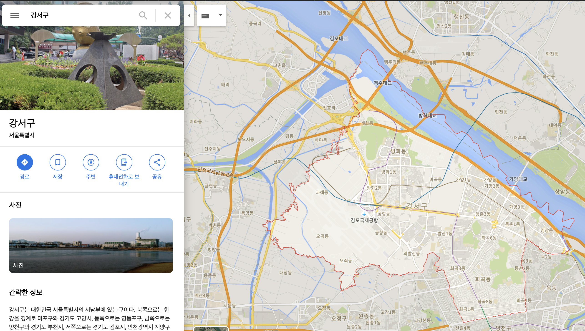

# 프로젝트 요약

## 프로젝트 명: mSNS(map SNS)

나의 입지를 한눈에 보여주는 mSNS

## 프로젝트 요약

map에 가장 like가 많은 post만 보이는 SNS, 나의 영향력을 한눈에 볼 수 있다.

## 프로젝트 키워드

SNS, Mobile Application

## 목적 및 필요성

1. user가 올리는 사진 또는 영상이 다른 사람들에게 얼마나 많은 공감을 받는지 확인
2. user가 사는 지역에서 나의 talent로 유명하지만 과연 다른 지역에서도 먹힐지 확인

## 프로젝트 개요

기존의 SNS의 대명사인 facebook과 instagram을 봤을 때 타임라인 형태는 user와 가까운(친밀한) 사람들이 올린 콘텐츠, user가 관심있는 콘텐츠만 볼 수 있게 특화되어 있다.

mSNS는 현재위치에 콘텐츠를 올리는 방식으로 그 위치 주변의 모든 콘텐츠들을 볼 수 있으며, 그 지역에서 가장 핫한 콘텐츠를 한눈에 볼 수 있다.

또한 내가 올린 콘텐츠가 다른 사람과의 like 경쟁을 할 수 있는 구도여서 사용자가 올린 콘텐츠가 어느정도의 영향력, 공감을 받을 수 있는지 알 수 있다.

**대표기능**

특정 지역에서 콘텐츠를 올리게 되면 기존의 타임라인 형태로 올라가게 된다.
일반 콘텐츠들은 모두 타임라인 형태로 올라가게 되며 콘텐츠가 하나의 지역 테두리 안에서 like 수가 가장 많으면 map tab에서 그 콘텐츠만 보이게 된다.

<b>**여기가 핵심**</b>

예를 들면 대한민국 강남구에서 올린 콘텐츠가 A와 B가 있다고 하자 A는 like의 수가 123개이고 B는 like 수가 110개이다.
그렇다면 map에서 강남구 지역의 콘텐츠는 A하나만 보이게 된다.
또한 C라는 콘텐츠가 송파구에서 like의 수가 80개라고 하면 map을 다시 줌 아웃했을 때 서울이라는 지역 테두리 내에서는 A라는 콘텐츠 하나만 보이게 된다.

이런식으로 특정지역에서 가장 핫한 콘텐츠가 무엇인지 가려낼 수 있으며 누구나 이런 콘텐츠 챌린지에 참가할 수 있다.

### 간략한 전체 UI 설명

파란색으로 표시된 부분은 **강조**
빨간색으로 표시된 부분은 **Issue 사항**

왼쪽 부터 Map(main), TimeLine, Flag, Follow, Profile 이다.

* Map

  내가 돌아다녔던 여행지에서 꽂은 post를 한번에 보여준다.

* Rank

  현재 위치(default) 또는 해당 위치 에서 볼 수 있는 포스트들을 보여준다.

* Add

  내가 포스트를 올릴 때 사용한다.

* Follow

  내가 좋아하는 유저들의 포스트들을 보여준다.

* Porfile

  개인정보, 설정, 발자취 등을 보여준다.

자세한 내용은 아래를 참고하도록 한다.

#### Map(main)

App을 실행하면 가장 먼저 보이는 화면이다.

**화면 표출 설명**

현재위치에 있는 가장 최소한의 단위(XX동)단위의 가장 인기가 많은 포스트들을 보여준다.
Zoom out을 했을 경우 Zoom out 정도에 따라서 인기가 많은 포스트들을 보여준다.

예를들어서 대한민국>서울시>강남구>역삼동 에서 가장 인기가 많은 PostA가 있고
대한민국>서울시>강남구>삼성동 에서 가장 인기가 많은 PostB가 있다.

각각의 PostA와 PostB는 각 동에서 인기가 많은 포스트들이다.
이제 Zoom-Out을 했을 경우 구 단위의 Post들만 보이기 시작하는데 PostA가 PostB가 인기가 많고, PostA가 강남구에서 인기가 가장 많다면 강남구에는 PostA 만 표출될 것이다.

상단의 버튼들은 같은 hierachy 레벨들의 지역명을 갖고있고, 눌렀을 경우 해당 지역으로 map이 이동한다.

Post 푯말(말풍선?) 눌렀을 경우에는 해당 포스트가 자세하게 나오도록 한다.

**Issue**

* 위의 국가/시/구/동 의 hierachy가 나라별로 다를 수 있다. 이 경우 어떻게 해야하는지
  상단에 보여지는 버튼들이 어떻게 바뀌어야 하는지
* ㅇㅇ

#### Rank

<b>왼:</b> 사진/영상 포스트, <b>오:</b> 사진/영상 포스트 와 글 포스트

Rank 화면은 현재위치(또는 사용자 설정위치)의 인기가 많은 순의 post를 나열한다.

Post는 사진/영상/글을 올릴 수 있고, 댓글과 좋아요 팔로우(별모양) 기능이 있다.
사진/영상의 경우에는 10자 내의 간단한 글을 같이 넣을 수 있다.
글의 경우에는 특별하게 10자 내의 간단한 글을 넣을 수 없다.

상단의 위치 hierachy는 터치해서 변경이 가능하다.

**Issue**

* 상단을 보면 현재 위치(또는 사용자 설정위치)가 알맞게 hierachy 되어 보여지는 것을 어떻게 구현할 것인지
  현재위치에 대한 hierachy를 만들경우 뽑아올 수 있는 data resource는 lat, lon 밖에 없는데 이 lat과 lon이 대한민국>서울시>강남구>삼성동에 위치하는 것을 어떻게 아는지?

#### Add

Add 버튼을 누르면 글쓰기/앨범/촬영 팝업이 나온다.

* 현위치에서만 사진을 올릴 수 있게 앨범 선택 항목을 빼는게 좋을까..?

#### Follow

#### Profile

Profile은 사용자의 개인정보 및 설정을 할 수 있는 곳이다.

**발자취**

여기서 가장 눈여겨 볼 부분은 발자취 기능이다.
발자취는 내가 포스트를 올린 곳의 지역을 보여준다.
예를 들어 대한민국>서울시>강남구>역삼동 에 포스트를 올렸다면 
Zoom-In을 했을 경우 대한민국>서울시>강남구>역삼동 에 표시가 되어있고 나의 포스트가 보인다.
Zoom-Out을 했을 경우 대한민국>서울시>강남구 전체 region에 표시가 되어있고 나의 포스트가 보인다.(강남구에 여러개의 포스트를 했다면 가장 인기있는 포스트만 보인다.)
나아가 전체 Zoom-Out했다면 국가 단위의 포스트가 보일 것이다.

## 기술 스택 및 협업 방법

### Back - end

docker를 이용해 여러개의 Express.js 서버 컨테이너를 만들어 k8s로 오케스트레이션을 하고, nginx를 이용해 load balancing하는 것을 최우선적인 목표로 두고 있다. ( 이 경우 트래픽이 몰려 서버가 죽을 확률이 높다. DevOps에 의존적이다. )

그 외 spring이나 spring boot를 고려할 수 있다. ( 이 경우 DevOps는 상대적으로는 신경 쓸 필요는 없을 듯 하다. )

DB는 mongoDB같은 noSQL이나 위치기반서비스에 최적화된 PostgreSQL을 사용한다.

* WAS: node.js, spring
* DB: MongoDB, PostgreSQL
* DevOps: k8s, nginx, docker

### Front - end(Moblie App)

iOS 개발을 하는 것을 우선적인 목표로 한다.

SwiftUI를 이용해 MVVM 패턴을 적용할 것이며, UIKit은 사용하지 않는다. 부득이하게 UIKit을 사용할 경우 UIViewRepresentable 을 이용한다.

### 그 외

publishing 까지 염두를 하고 있다면 Jenkins를 이용하도록 한다.

협업 툴은 trello와 slack을 이용하도록 한다.

형상관리는 github을 이용한다.

## 생각 해봐야하는 것

가장 큰 문제는 지도 data의 수급과 많은 데이터를 응답해줘야 할 때 이다.

* 지도는 각 지역의 경계선이 json 좌표 형태로 되어있는 것이 이상적이다.

  한국의 지도 데이터는 [여기](https://github.com/southkorea/southkorea-maps)를 한번 참고하는 것이 좋다.

  미국의 경우 본 프로젝트 제안서 폴더에 "03_us-states.json"을 보도록 한다.
  (좌표를 넣으면 PostgreSQL에서 면적이나, 그 좌표를 안에 있는지의 여부를 계산을 해준다고 들었는데 자세히 찾아봐야함.)

* 사용자가 늘어남에 따라 지도가 지저분 해질 수 있다. 이 같은 경우는 아래 알고리즘을 이용하면 해결될 듯하다.

  

* 지도에서 각 시군구를 자를예정이라면 구글맵, 네이버맵등 지원해주는 API가 있는지 확인해봐야한다.
  없을 경우 맵을 직접 제작을 해야하는데...

  

  Google Map 자체에서는 시, 군, 구 , 동 입력했을 시 표시가 되는데 [여기](https://stackoverflow.com/questions/9706484/add-search-area-outline-onto-google-maps-result)에서는 안될거라고 말하는데 한번 찾아봐야함.

  우리가 필요한 내용은

  * GPS 좌표 입력 시 여기가 어디 구역 내인지 판별
    * 흐음 ...
  * 구역 이름(e.x. 강서구, 삼성동 ... ) 입력 시 지도에서 하이라이팅

## Persona

**Case1.**

강원도 태백에 사는 소녀가 자신의 동네에서는 인기가 많다.
그러나 소녀는 자신이 다른 지역에서도 얼마나 인기가 많은지 알고싶다.
mSNS에 컨텐츠를 올리자 사람들의 반응은 폭발적이었다. 자신의 동내 뿐만아니라 강원도내, 더 나아가 대한민국에서 가장 인기가 많았다.
평범한 소녀지만 그녀는 SNS스타가 되었고 사람들의 이목을 집중받았다.

**Case2.**

프랑스 여행을 다녀온 한국인 A씨는 프랑스 여행도중 몽마르뜨언덕에서 mSNS를 이용해 사진을 하나 올렸다. 사진은 사람들에게 폭발적인 반응을 얻었고 몽마르뜨 지역에서는 A씨의 사진이 가장 인기가 많아서 그 사진하나만 보인다.
한국에 돌아온 A씨는 앱을 통해 그 상황을 보고 있다.

